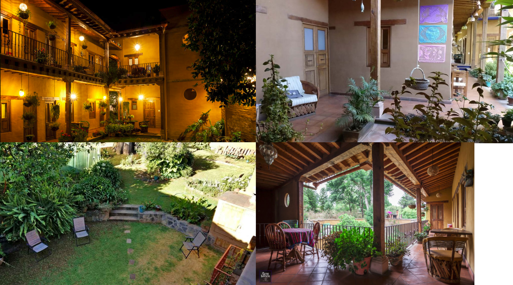

The Xpiritual Bioinformatics Retreat is a one week experience of project presentations, networking, bioinformatics workshops, drinks and good talks for a multidisciplinary scientific community, sharing knowledge around biological topics.

This year's summer edition will take place from June 12, 2022 to June 18, 2022 at Pátzcuaro, Michoacán; Mexico's magic town near Patzcuaro´s lake.

# Organizers

This event is organized by people from the [Bioinformatics and Complex Networks Lab](https://ira.cinvestav.mx/ingenieriagenetica/dra-maribel-hernandez-rosales/bioinformatica-y-redes-complejas/) located at CINVESTAV Irapuato, Guanajuato. In case of questions, feel free to contact us via: [bioinfoandcomplexnetworks@gmail.com](mailto:bioinfoandcomplexnetworks@gmail.com).

José Antonio Ramírez-Rafael | [@jxrrTecn](https://twitter.com/jxrrTecn)

Marisol Navarro-Miranda      | [@solnavss](https://twitter.com/solnavss)

Octavio Zambada-Moreno    | [@octavirus23](https://twitter.com/octavirus23)

# Location

The meeting will take place at Hotel [Posada Yolihuani](https://posada-yolihuani.com/inicio/) ([Calle Doctor Cos 40, Centro, 61600 Pátzcuaro, Mich](https://g.page/PosadaYolihuani-Patzcuaro?share)).

The hotel has 10 rooms for a maximum of 30 people. Each room has a bedroom and its own bathroom including a shower. If by the moment of your registration Hotel Posada Yolihuani is fully booked, we have the possibility to get rooms in another hotel (Mesón San Antonio).

# Scientific Program

It is desirable for every participant to present his/her scientific work. This is not a burden but a good chance to present your scientific results in order to connect with people that may be interested in your topic. If you're a member of the Bioinformatics & Complex Networks Lab, your presentation is mandatory. We will have two kinds of talks: 

- **Regular talk:** 15 minutes talk + 5 minutes questions

- **Extended talk (1 per day):** 30 minutes talk + 10 minutes questions 

A meaningful (preliminary) title should be given at the registration process in order to schedule talk sessions. As usual, we provide a video projector (with VGA & HDMI port) and a laser pointer for the presentations. 

Further information on the time table will be given at time. 

# Workshop

Further information on the workshop will be given at time. 

# Fee

Fee modality per person.

| Room capacity             | Price (MNX) |
| ------------------------- | ----------- |
| Single room, 1 person     | $ 6,900     |
| Single room, 2 people     | $ 3,600     |
| Double room, personal bed | $ 5,500     |
| Double room, shared bed   | $ 3,690     |

**Note:** According to availability

The conference fee includes accommodation at Hotel Posada Yolihuani, breakfast and late night snacks. 

After your registration you will receive an email with all the details about the payment information including the conference bank account. 

In order for us to consider your registration, **you need to pay half of the fee before May 16th** and the other half should be paid with no exceptions before May 30th. *Also if you prefer, you can pay the full fee before May16th.

The conference fee can only be refunded if the registration is canceled until the end of the registration deadline on May 30th (per e-mail). Otherwise your fee will not be refunded.

**Note:** Traveling expenses are on you. Also you can contact us if you have difficulties arriving at the Hotel.

# Check-in

The registration/check-in will be in the dining room of Hotel Posada Yolihuani Jun 18, 2022 from 3pm to 6pm. If you are arriving prior to registration, please do not check in with the hotel, but wait for the organizing team. We will hand you over the key and registration information. Please note that late-night registration will not be supported after 8 pm even for those running late. 

# Family

Your family is welcome to join us in Patzcuaro! 

Depending on the number of children and the size of the families, we will try to accommodate families separately from the party people and the lecture hall in a different accommodation. 

# Registration

Please fill the [this form](https://docs.google.com/forms/d/e/1FAIpQLSf8glFV3OccUpQjKYZLRkC9zLZ6owSyGr_CrpnPDIzTxiz3pA/viewform?usp=sf_link). 

You have until May 16th.

# Further information

- **Cash:** Pátzcuaro is a small town, so it's probable that most places don't accept credit/debit cards. Please consider having enough cash (mexican pesos) to ensure additional meals, drinks, etc. 

- **Internet:** WIFI is available in Hotel Posada Yolihuani, but might not cover all rooms equally.
